👋 Hi I'm Fernando!

I study Computer Science Engineering at _Universidad Francisco de Vitoria_ and my passion is programming. I'd love to <kbd><strong>[hear your feedback](https://github.com/FernandoPerezLara/FernandoPerezLara/issues/new?assignees=FernandoPerezLara&labels=dont+like+you%2C+feedback%2C+like+this+color%2C+you+are+coot+but&template=feedback-is-the-breakfast-of-champions.md&title=Insert+here+a+cool+title+%F0%9F%98%8E)</strong></kbd> about me. If you just come to say hello, you are welcome.

# Did you know…?

- 🎨 I have my own [portfolio](http://fernandoperezlara.github.io/) where you can see everything about me.
- 🎮 I love to play video games with my friends and meet people from all over the world.
- 🤖 Love robotics; that's why I have built my own 3D Printer.
- 🧬 I love science fiction. My favourite book is [Foundation](https://www.goodreads.com/book/show/29579.Foundation) and my favourite film is [Men In Black](https://www.filmaffinity.com/en/film968702.html).
- 🎓 As a personal challenge, I usually learn a new programming language every three months.

